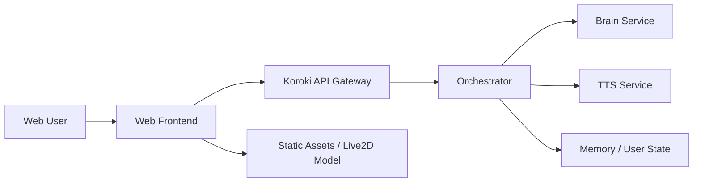

# Koroki Web Version Plan

## Goal

Move Koroki from a local-heavy desktop/Discord-first setup into a web-based experience that:

- keeps Koroki's current regal / poetic personality
- is voice-first and visual-first
- shows clear online/offline service state
- uses Live2D for emotional expression
- supports lip sync during voice playback
- does not require end users to host Brain + TTS locally

## Current Constraints

- Local Brain + resident TTS is too heavy for a 12 GB GPU.
- Text-first + deferred voice is acceptable locally, but not ideal as the final public product UX.
- The current Live2D model folder exists at:
  [`C:\Users\Shinn\Desktop\Koroki\神宫白子公皮`](C:\Users\Shinn\Desktop\Koroki\神宫白子公皮)
- The model has:
  - `.model3.json`
  - `.moc3`
  - `.physics3.json`
  - textures
  - expression files
- The display info indicates lip-sync capable mouth parameters:
  - `ParamMouthOpenY`
  - `ParamMouthForm`

## Important Asset Note

The usage note in the model folder indicates the model is copyrighted and tied to the original publisher/release channel.

Before shipping a public web app that redistributes the model files, confirm that public redistribution and web-hosted delivery are allowed under the model's terms.

This is separate from technical feasibility.

## Recommended Product Shape

Use a browser frontend with a remote backend.

### Why

- Users do not need a GPU.
- Koroki can stay high quality.
- We can show whether the service is online or offline directly in the web UI.
- Live2D works naturally in the browser.
- Audio playback + lip sync is easier in the browser than in Discord.

## Recommended Architecture



## Frontend Responsibilities

- chat UI
- voice playback UI
- Live2D rendering
- lip sync during playback
- emotion display / expression switching
- online/offline indicator
- reconnect / retry behavior

## Backend Responsibilities

- authentication and session identity
- request validation
- conversation state
- emotion state
- model inference
- TTS generation
- streaming or chunked response delivery
- health endpoints for web availability status

## Frontend Stack Recommendation

### Best fit

- `Next.js` or `Vite + React`
- TypeScript
- Live2D Cubism Web SDK or a browser wrapper around it
- Web Audio API for playback + amplitude analysis

### Why

- React is good for a stateful character UI
- easy routing and deployment
- strong ecosystem for animation/audio overlays
- supports a "companion app" feeling without requiring install

## Live2D Integration Plan

### Phase 1

- render the model
- idle breathing and blinking
- basic head / eye movement
- map emotional state to expression presets

### Phase 2

- drive `ParamMouthOpenY` during audio playback
- lightly drive `ParamMouthForm` by emotion family
- drive blush / anger / eye-softening params when present

### Phase 3

- micro-idle behavior
- gesture / accessory toggles from expression packs
- richer motion states tied to emotional state

## Lip Sync Plan

Do not block on perfect phoneme lip sync at first.

### Initial version

- play TTS WAV or streamed audio in browser
- analyze amplitude envelope with Web Audio API
- map amplitude to `ParamMouthOpenY`
- map emotional family to `ParamMouthForm`

This is enough for convincing "alive" speech in a first version.

### Later upgrade

- viseme or phoneme-aware lip sync if TTS can expose timing metadata

## Emotion Display Plan

The frontend should not guess emotion from text alone.

It should receive emotion metadata from the backend, such as:

- primary emotion
- secondary emotion tags
- intensity
- suggested visual variant
- suggested voice variant

### Example payload shape

```json
{
  "emotion": {
    "primary": "caring",
    "secondary": ["thoughtful"],
    "intensity": 63,
    "visual_variant": "soft_close",
    "voice_variant": "caring_tender"
  }
}
```

## API Shape Recommendation

### `POST /v1/chat`

Returns text plus emotional metadata and either:

- `audio_url` when pre-generated
- or `audio_job_id` if voice is still processing

### `GET /v1/health`

Used by the web frontend to display:

- online
- degraded
- offline

### `GET /v1/audio/:id`

Returns TTS audio or job state.

### `WS /v1/session/:id`

Optional later upgrade for:

- token streaming
- incremental emotion updates
- TTS job completion events
- presence / system status

## Recommended UX

### Main view

- large central Live2D canvas
- compact chat transcript
- playback controls
- microphone / text input area
- online/offline badge

### Behavioral goals

- text should appear quickly
- voice should follow naturally
- character should visibly react before and during speech
- offline state should be graceful, not broken-looking

## Migration Plan

### Step 1

Keep the current Python backend.

Add a web client first instead of rewriting everything.

### Step 2

Expose the backend in a cleaner web-friendly way:

- auth/session layer
- CORS tightening
- stable JSON response contract
- audio URL or job-based delivery

### Step 3

Build a small web prototype that proves:

- Live2D renders
- text chat works
- one-click audio playback works
- mouth opens during playback
- emotion metadata changes expression

### Step 4

Refine for public hosting:

- deployment topology
- auth
- moderation / abuse protection
- rate limiting
- persistence

## What Not To Do First

- Do not start with perfect visemes.
- Do not rewrite Brain/TTS first.
- Do not try to fully replace Discord immediately.
- Do not over-design multiplayer/community features before the single-user companion flow feels right.

## Immediate Next Build Target

Build a browser proof-of-concept with:

- chat box
- model render
- online/offline badge
- backend text reply
- delayed audio playback
- mouth opening from playback amplitude
- expression switching from backend emotion metadata

That is the smallest version that proves the product direction.
